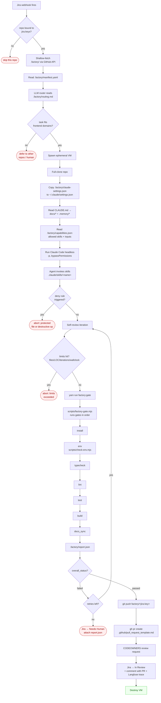

# Agent flow in this repo

How an agent from the external factory behaves from the moment a Jira webhook
fires until a PR is opened (or the task is bounced back to a human). Every box
maps to a file in this repo, so you can trace any step back to its rule.

Companion to [docs/factory.md](./factory.md) — that file lists _what_ each
artifact is; this one shows _when_ it gets read.

## Mermaid flow



## Step-by-step

### Phase 1 — Routing (no VM yet, factory orchestrator only)

| #   | Action                                                                          | File read                                           |
| --- | ------------------------------------------------------------------------------- | --------------------------------------------------- |
| 1   | Jira webhook fires; orchestrator looks up repos by `jira.keys`                  | factory-side DB                                     |
| 2   | For each candidate repo, shallow-fetch only `.factory/` via GitHub contents API | —                                                   |
| 3   | Parse `manifest.yaml` → stack, commands, gates, limits, skills_allowed          | [.factory/manifest.yaml](../.factory/manifest.yaml) |
| 4   | LLM router decides whether this repo is a target                                | [.factory/routing.md](../.factory/routing.md)       |
| 5   | If no → skip; if yes → mark this repo for execution                             | —                                                   |

### Phase 2 — Spawn (one VM per target repo)

| #   | Action                                                                           | File read                                                         |
| --- | -------------------------------------------------------------------------------- | ----------------------------------------------------------------- |
| 6   | Boot ephemeral VM (Fargate / Firecracker); image matches `stack.node` + `.nvmrc` | [.nvmrc](../.nvmrc), [package.json](../package.json) `engines`    |
| 7   | Full-clone the repo with a short-lived GitHub App token                          | —                                                                 |
| 8   | Copy `.factory/claude-settings.json` → `~/.claude/settings.json` inside the VM   | [.factory/claude-settings.json](../.factory/claude-settings.json) |
| 9   | Set env: `CI=true`, `FORCE_COLOR=0`, `GIT_TERMINAL_PROMPT=0`, `HUSKY=0`          | same file, `env` section                                          |

### Phase 3 — Context loading (agent boots)

| #   | Action                                        | File read                                                                                                      |
| --- | --------------------------------------------- | -------------------------------------------------------------------------------------------------------------- |
| 10  | Claude Code auto-loads project rules          | [CLAUDE.md](../CLAUDE.md)                                                                                      |
| 11  | Agent follows the "Read first" instruction    | [.memory/MEMORY.md](../.memory/MEMORY.md), [.memory/task_routing.md](../.memory/task_routing.md)               |
| 12  | Reads topical docs the task touches           | [docs/architecture.md](./architecture.md), [docs/rbac.md](./rbac.md), [docs/code-style.md](./code-style.md), … |
| 13  | Reads module-local rules if changing a module | `src/modules/<name>/CLAUDE.md`                                                                                 |
| 14  | Reads available skills index                  | [.factory/capabilities.json](../.factory/capabilities.json)                                                    |

### Phase 4 — Implementation loop

| #   | Action                                                                                                                      | Guardrail                                                                            |
| --- | --------------------------------------------------------------------------------------------------------------------------- | ------------------------------------------------------------------------------------ |
| 15  | Agent runs Claude Code headless: `claude -p "<jira task>" --permission-mode bypassPermissions`                              | `defaultMode: "bypassPermissions"`                                                   |
| 16  | Agent invokes whitelisted skills only                                                                                       | `manifest.skills_allowed` + `claude-settings.json#deny`                              |
| 17  | Any deny-listed op (`git push --force`, `rm -rf .git`, write to `.env`, edit `.factory/**`) → tool errors, agent must adapt | [.factory/claude-settings.json](../.factory/claude-settings.json) `permissions.deny` |
| 18  | After each iteration: self-review pass; orchestrator counts iterations                                                      | `manifest.limits.max_self_review_iterations`                                         |
| 19  | If diff exceeds `max_files_changed` / `max_loc_changed` / wallclock → abort                                                 | `manifest.limits`                                                                    |
| 20  | If diff touches `protected_paths` not justified by the task → abort                                                         | `manifest.protected_paths`                                                           |

### Phase 5 — Gates (deterministic, no LLM)

`scripts/factory-gate.mjs` runs in this order. First failure stops the chain
and writes the failed gate to `.factory/report.json`.

| Gate      | Command                          | Failure means                              |
| --------- | -------------------------------- | ------------------------------------------ |
| install   | `yarn install --frozen-lockfile` | yarn.lock drift, registry issue            |
| env       | `node scripts/check-env.mjs`     | Wrong Node major, missing required env var |
| typecheck | `yarn typecheck`                 | TS error                                   |
| lint      | `yarn lint`                      | Style / boundaries violation               |
| test      | `yarn test`                      | Vitest failure                             |
| build     | `yarn build`                     | Vite build broke                           |
| docs_sync | `yarn run docs:sync`             | Code drifted from `docs/*`                 |

Report shape:

```json
{
  "overall_status": "passed | failed | errored",
  "failed_at": "<gate id or null>",
  "gates": [{ "id", "command", "exit_code", "status", "duration_ms", "stdout_tail", "stderr_tail" }]
}
```

### Phase 6 — Artifact

| #   | Action                                                                                  | File read                                                               |
| --- | --------------------------------------------------------------------------------------- | ----------------------------------------------------------------------- |
| 21  | If `overall_status: passed` → create branch `factory/<jira-key>`, push                  | `manifest.outputs.branch_prefix`                                        |
| 22  | Open PR with template; fill Jira key, Langfuse trace, agent run id, skills used         | [.github/pull_request_template.md](../.github/pull_request_template.md) |
| 23  | `CODEOWNERS` auto-requests review from the owner                                        | [.github/CODEOWNERS](../.github/CODEOWNERS)                             |
| 24  | Orchestrator transitions Jira: `→ In Review`, comments with PR URL + trace              | `manifest.jira.transitions.on_pr_opened`                                |
| 25  | If `overall_status: failed` and no retries left → Jira `→ Needs Human`, report attached | `manifest.jira.transitions.on_failure`                                  |
| 26  | VM destroyed; secrets revoked                                                           | infra layer                                                             |

## Where each rule "fires"

```
.factory/manifest.yaml         → phases 1, 2, 4, 5, 6  (routing, limits, gates, outputs)
.factory/routing.md            → phase 1                (LLM router decision)
.factory/capabilities.json     → phase 3                (skills index for the agent)
.factory/claude-settings.json  → phases 2, 4            (permissions, env, deny)
CLAUDE.md + docs/* + .memory/* → phase 3                (project rules)
.claude/skills/<name>          → phase 4                (atomic actions)
scripts/factory-gate.mjs       → phase 5                (gate orchestration)
scripts/check-env.mjs          → phase 5 (env gate)     (early failure)
.github/pull_request_template  → phase 6                (PR contract)
.github/CODEOWNERS             → phase 6                (review routing)
.nvmrc + package.json engines  → phase 2                (deterministic VM)
```

## Failure modes — at a glance

| Failure                        | Detected by                                              | Result                                                        |
| ------------------------------ | -------------------------------------------------------- | ------------------------------------------------------------- |
| Task doesn't belong here       | Phase 1 router                                           | Skip this repo silently                                       |
| Wrong Node version             | `check-env.mjs`                                          | Gate `env` fails before build runs                            |
| Agent tries `git push --force` | `claude-settings.json#deny`                              | Tool errors, agent adapts or aborts                           |
| Agent edits `.factory/**`      | `claude-settings.json#deny` + `manifest.protected_paths` | Diff rejected post-run                                        |
| Lint / type / test red         | Phase 5 gate                                             | Self-review loop retries up to limit, then Jira → Needs Human |
| Loop runs forever              | `manifest.limits.max_wallclock_minutes`                  | Orchestrator kills VM                                         |
| Docs drifted                   | Gate `docs_sync`                                         | Same as any other gate failure                                |
| Diff too large                 | `manifest.limits.max_files_changed` / `max_loc_changed`  | Abort, suggest task split                                     |
