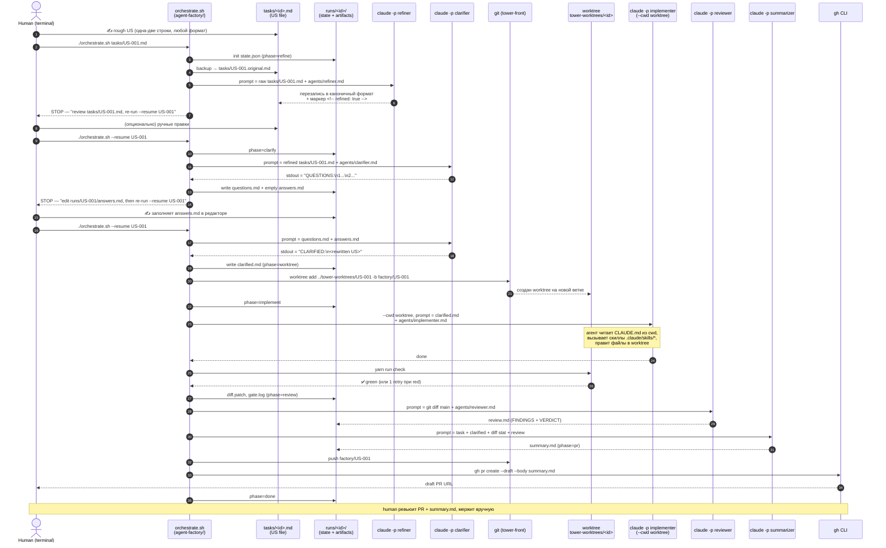

# Local agent-factory MVP

## Context

Воспроизводим локально упрощённую версию factory-флоу из [tower-front/docs/factory-agent-flow.md](../../Desktop/artkai/tower-front/docs/factory-agent-flow.md): отдельный проект-оркестратор (`agent-factory`) запускает Claude Code headless-агентов, которые работают с целевым репозиторием `tower-front` через `git worktree`. Цель — потестить мульти-агентный конвейер (clarify → implement → gate → review → summary → PR) под Claude Pro подпиской без API-ключа, без облака и без Jira.

Источник правил для агентов — `tower-front/CLAUDE.md`, `docs/*`, `.claude/skills/*`, `.factory/claude-settings.json`. Factory-репо НИЧЕГО из этого не дублирует, только промпты ролей и оркестрацию.

## Architecture — single resumable session со субагентами

**Ключевая идея:** один US = одна Claude Code сессия с фиксированным `--session-id <uuid>`. Bash-обёртка стартует/резюмит её на стопах для human; внутри сессии orchestrator-агент через Task tool делегирует работу специализированным субагентам (refiner, clarifier, implementer, reviewer, summarizer). Это вместо N последовательных `claude -p` с полным prefill контекста каждый раз.

**Почему это работает на CLI:** `claude -p` поддерживает нативно:

- `--session-id <uuid>` — фиксированный ID сессии (не autoSelectный).
- `-r <session-id>` — resume с полным контекстом, кэш промпта в силе.
- `--agent <name>` и `--agents <json>` — задают какой агент стартует.
- Субагенты как файлы `agent-factory/.claude/agents/<name>.md` (frontmatter с `name`/`description`/`tools`, тело — системный промпт). Orchestrator-агент вызывает их через Task tool.

**Что осталось в bash:**

1. Preflight (gh, remote, claude CLI).
2. Создание `git worktree` (не агентская работа).
3. Парсинг сентинелов из output orchestrator'а: `WAITING_HUMAN: <blocker>`, `READY_FOR_PR`, `NEEDS_HUMAN: <reason>`.
4. После сентинела `READY_FOR_PR` — `git push` + `gh pr create` (агенту это не разрешено).
5. Обновление `runs/<id>/state.json` на каждом переходе.

**Что в одной сессии (через Task tool):**

- refine → (stop) → clarify → (stop optionally) → implement → gate (как Bash tool call внутри implementer'а, не отдельная фаза) → review → summary → emit `READY_FOR_PR`.
- Гейт внутри implementer'а: он сам вызывает `yarn run check` через Bash tool. Если красный — сам ретраится (одна попытка). Это убирает один bash-агент-bash переход.

**Поток с stops:**

```
1. bash: gen UUID, init state.json, start
   claude -p --session-id $UUID --agent orchestrator \
     --permission-mode bypassPermissions \
     --add-dir $TARGET_REPO \
     "Start US-001 pipeline from phase=refine"

2. orchestrator → Task(refiner) → пишет tasks/US-001.md
   orchestrator emits: "WAITING_HUMAN: review tasks/US-001.md"
   exit

3. bash: видит WAITING_HUMAN, пишет state.phase=waiting_human, blocker, выходит

4. human правит файл, запускает: ./orchestrate.sh --resume US-001

5. bash: claude -p -r $UUID "human approved, continue from refine"
   ← сессия восстанавливается из кэша, без prefill

6. orchestrator → Task(clarifier) → может ещё одна пауза (questions.md)
   ... → Task(implementer) → implementer сам yarn run check
   ... → Task(reviewer) → Task(summarizer)
   orchestrator emits: "READY_FOR_PR"
   exit

7. bash: git push + gh pr create --draft
   bash: state.phase=done, pr_url записан
```

**Преимущества над N×claude-p:**

- Один prefill `CLAUDE.md`/`docs/*`/skills на весь US. Resume цепляется к кэшу.
- Промежуточные артефакты (clarified.md и т.д.) больше не нужны как протокол передачи — сессия помнит сама. Их пишем только для дашборда и human-ревью.
- Стрим `--output-format stream-json` показывает Task-events субагентов в одном потоке → UI видит «сейчас работает clarifier через add-form skill» без склеивания файлов.

**Минусы / что осторожно:**

- Если сессия дропается (rate-limit, crash) — resume может потерять последнее состояние. Митигация: orchestrator сам обновляет `state.json` через Bash tool на каждом своём шаге, не только bash-обёртка.
- Pro-лимит сообщений всё ещё применим, но prefill больше не умножается на 5.
- Async-пауза через output sentinel требует, чтобы orchestrator-агент дисциплинированно эмиттил их и сразу exit'ил. Это в его системный промпт прописывается строго.

## Layout

```
~/Desktop/artkai/
├── tower-front/          (без изменений — target)
├── tower-worktrees/      (создаются на лету, в .gitignore tower-front)
│   └── US-XXX/
└── agent-factory/        (НОВЫЙ репо)
    ├── orchestrate.sh
    ├── lib/
    │   ├── phases.sh     (функции по фазам)
    │   └── state.sh      (read/write runs/<id>/state.json)
    ├── .claude/
    │   ├── agents/         (Claude Code subagents, вызываются через Task tool)
    │   │   ├── orchestrator.md  (top-level: дёргает остальных, эмиттит сентинелы)
    │   │   ├── refiner.md       (тонкий триггер: «invoke refine-story skill»)
    │   │   ├── clarifier.md
    │   │   ├── implementer.md   (включая self-gate через Bash(yarn run check))
    │   │   ├── reviewer.md
    │   │   └── summarizer.md
    │   └── skills/
    │       └── refine-story/
    │           └── SKILL.md    (как правильно переписать US: формат + где в коде что лежит)
    ├── config/
    │   └── targets.yaml  (US-prefix → repo path)
    ├── tasks/            (user stories на вход)
    ├── runs/             (артефакты прогонов, в .gitignore)
    ├── ui/
    │   ├── server.mjs    (zero-deps Node http server, localhost:7777)
    │   └── index.html    (vanilla JS дашборд)
    └── README.md
```

## Диаграмма последовательности

Один прогон US (без ретраев). Колонки — реальные процессы/файлы; стрелки идут сверху вниз во времени. Все `claude -p` — отдельные headless-вызовы CLI под одной сессией Pro.



## Как это тестировать локально (walkthrough)

Пошагово: где лежат таски, куда отвечать на вопросы, как появляются ветки и worktree, где смотреть результат.

### Подготовка (один раз)

1. `agent-factory/` создан рядом с `tower-front/` (см. Layout).
2. Скопировать настройки прав агента:
   ```
   cp tower-front/.factory/claude-settings.json ~/.claude/settings.json
   ```
   Это даёт headless-режиму whitelisted-набор тулов и `bypassPermissions`. Делается один раз, влияет на ВСЕ `claude -p` запуски на машине — если у тебя уже есть `~/.claude/settings.json`, сделай бэкап.
3. Залогиниться в CLI: `claude` (если ещё не) — Pro-сессия должна быть активна.
4. (опционально) `gh auth status` — для авто-создания PR.

### Шаг 1. Положить базовый набросок user story

Создаёшь руками `agent-factory/tasks/US-XXX.md`. **Формат свободный** — можно одну строчку, можно три. Цель — описать идею, не писать ТЗ:

```
# US-001
Нужен компонент Greeting в shared/ui, который выводит "Hello, <name>!".
Должен быть тест.
```

ID = имя файла без `.md`. Используется как идентификатор run, имя ветки (`factory/US-001`) и имя worktree.

### Шаг 2. Первый запуск — refine + clarify

```
cd agent-factory
./orchestrate.sh tasks/US-001.md
```

Что произойдёт:

1. **Refine.** Оригинал бэкапится в `tasks/US-001.original.md`. Refiner-агент переписывает `tasks/US-001.md` в каноничный формат (Title / Story / Acceptance / Scope / Notes) и ставит маркер `<!-- refined: true -->`. Скрипт **останавливается**, печатает diff и просит ревьюнуть.
2. Ты открываешь `tasks/US-001.md` в IDE — видишь улучшенную US. Можешь поправить руками или принять как есть.
3. `./orchestrate.sh --resume US-001` — refine пропускается (маркер на месте), идёт clarify. Либо появится `runs/US-001/questions.md` со списком вопросов и **скрипт снова остановится** с сообщением «edit `runs/US-001/answers.md` and re-run», либо clarifier сразу запишет `clarified.md` (тогда прыгай к Шагу 4).

### Шаг 3. Ответы на вопросы (async через файл)

Открываешь в IDE `agent-factory/runs/US-001/answers.md`, пишешь ответы по номерам вопросов. Сохраняешь. **Скрипт в этот момент не запущен — он давно завершился, ты не торопишься.**

```
./orchestrate.sh --resume US-001
```

Clarifier перезапустится, прочитает questions+answers, выдаст `clarified.md`. Если ответы недостаточны — снова `questions.md` (с новыми вопросами), цикл повторяется. На практике 1-2 итерации.

### Шаг 4. Имплементация (автоматически)

После того как `clarified.md` готов, тот же `--resume` идёт дальше БЕЗ остановки:

1. **Worktree.** Скрипт делает `git -C ../tower-front worktree add ../tower-worktrees/US-001 -b factory/US-001`. Это создаёт:
   - новую ветку `factory/US-001` в `tower-front/.git` (из `main`)
   - физический рабочий каталог `~/Desktop/artkai/tower-worktrees/US-001/` с этой веткой checked-out
   - **`tower-front/` сам остаётся на твоей ветке** — оркестратор туда не лезет
2. **Implement.** `claude -p --cwd ../tower-worktrees/US-001 --append-system-prompt agents/implementer.md "<clarified>"`. Агент видит worktree как обычный проект, читает `CLAUDE.md`, использует скиллы, правит файлы.
3. **Gate.** `(cd ../tower-worktrees/US-001 && yarn run check) > runs/US-001/gate.log 2>&1`. Если красный — один ретрай implementer'а с `gate.log` в промпте. Снова красный → пометить `needs_human`, всё равно сделать summary, но PR не создавать.
4. **Review.** `claude -p` с `git diff main` и `agents/reviewer.md` → `runs/US-001/review.md`.
5. **Summary.** `claude -p` с `agents/summarizer.md` → `runs/US-001/summary.md`.

### Шаг 5. PR

Если гейт зелёный:

```
git -C ../tower-worktrees/US-001 push -u origin factory/US-001
gh pr create --draft --title "[US-001] ..." --body "$(cat runs/US-001/summary.md)"
```

В консоли — URL draft PR. Открываешь в браузере, читаешь summary, смотришь review.md как отдельный артефакт, мержишь вручную.

### Шаг 6. Что куда смотреть после прогона

| Что хочешь увидеть            | Где                                               |
| ----------------------------- | ------------------------------------------------- |
| Что агент в итоге понял из US | `agent-factory/runs/US-001/clarified.md`          |
| Что агент НАписал в код       | `cd ../tower-worktrees/US-001 && git diff main`   |
| Прошёл ли `yarn run check`    | `agent-factory/runs/US-001/gate.log`              |
| Что нашёл reviewer            | `agent-factory/runs/US-001/review.md`             |
| Краткое резюме                | `agent-factory/runs/US-001/summary.md`            |
| Текущая фаза прогона          | `agent-factory/runs/US-001/state.json`            |
| Сама ветка                    | `git -C ../tower-front branch --list 'factory/*'` |
| Физическое дерево с правками  | `~/Desktop/artkai/tower-worktrees/US-001/`        |

### Шаг 7. Cleanup после ручного мержа

```
./orchestrate.sh cleanup US-001
```

Удаляет worktree и локальную ветку. Артефакты в `runs/US-001/` остаются как история.

### Типичные сценарии тестирования

- **Smoke (всё проходит с первого раза):** `tasks/US-000-smoke.md` = тривиальная задача типа «добавь компонент `<Greeting>`». Ожидание: clarifier может ничего не спросить → pipeline проходит до PR без участия человека.
- **Async clarify:** намеренно расплывчатая US без acceptance criteria. Ожидание: questions.md → ты отвечаешь → clarified → дальше.
- **Gate retry:** US, в которой агент скорее всего наврёт с типами. Ожидание: первый `yarn run check` красный → авто-ретрай → второй зелёный → PR.
- **Needs-human:** заведомо невыполнимая US. Ожидание: 2 красных гейта → `state.phase=needs_human`, есть `summary.md` с пометкой «gate failed», PR НЕ создан.

## Поток `orchestrate.sh <task-file>` (или `--resume <task-id>`)

Идемпотентен: каждая фаза проверяет свой артефакт, пропускает если есть. Стейт — `runs/<id>/state.json` с полем `phase`.

### 0. refine (нормализация исходной US, in-place)

Цель: ты пишешь US в любом виде (даже одну строчку «добавь кнопку logout»), агент переписывает её в каноничный формат, который потом стабильно потребляют clarifier и implementer.

Вся **логика** «как именно правильно переписать US» вынесена в скилл `.claude/skills/refine-story/SKILL.md` (см. ниже). Фаза refine — это просто запуск headless-агента, который должен дёрнуть этот скилл.

- Идемпотентность: если файл уже содержит маркер `<!-- refined: true -->` в первой строке — фаза пропускается.
- Перед перезаписью: оригинал копируется в `tasks/<id>.original.md` (один раз; если бэкап уже есть — не перетирать).
- Запуск:
  ```
  claude -p --permission-mode bypassPermissions \
    --add-dir "$TARGET_REPO" \
    --append-system-prompt "$(cat agents/refiner.md)" \
    "Refine the user story at tasks/<id>.md. Use the refine-story skill. \
     Target repo for context: $TARGET_REPO."
  ```
  `--add-dir` нужен чтобы скилл мог `grep`/`Read` по `tower-front/src` и подставить корректные пути к модулям/компонентам/скиллам.
- Скилл сам перезаписывает `tasks/<id>.md` (через Write/Edit tool), ставит маркер `<!-- refined: true -->` первой строкой.
- **Stop-for-human:** после refine скрипт **печатает diff против оригинала и останавливается** с сообщением «review `tasks/<id>.md`; re-run `--resume <id>` to continue».
- На `--resume` фаза refine видит маркер, пропускается, идём в clarify.

#### Скилл `.claude/skills/refine-story/SKILL.md`

Скилл следует тому же контракту что и существующие скиллы в `tower-front/.claude/skills/*` (frontmatter с `name`/`description`, ≤200 строк). Содержание:

- **Когда использовать:** при необходимости привести US (Jira-style, freeform draft, разговорный текст) к каноничному формату для агентов.
- **Входы:** путь к US-файлу (например `tasks/US-001.md`); опционально путь к target repo для контекстных подсказок.
- **Каноничный шаблон** (скилл его и навязывает):

  ```
  <!-- refined: true -->
  # <ID> — <short imperative title>

  ## Story
  As a <role>, I want <capability>, so that <value>.

  ## Acceptance criteria
  - [ ] <observable, testable criterion 1>
  - [ ] <criterion 2>

  ## Scope
  - in:  <what IS in scope>
  - out: <what is explicitly NOT — guard against scope creep>

  ## Where in code (pointers, ≤5 bullets)
  - <area or file/dir> — <one-line why this is relevant>
  - <skill to use, e.g. `add-component` / `add-page` / `add-rtk-endpoint`>

  ## Notes
  - <link to docs/* sections that apply: code-style.md, architecture.md, rbac.md>
  - <known constraints from CLAUDE.md or module CLAUDE.md>
  ```

- **Правила контента** (скилл инструктирует агента):
  1. Если в исходной US нет acceptance criteria — выведи минимальные observable, помеченные `TBD` если не выводятся из текста.
  2. Секция **Where in code** обязательна и должна быть **короткой и конкретной**: путь + одна строка почему. Использовать grep по `tower-front/src` для верификации существования путей. Если задача создаёт новый модуль — указать имя скилла `add-module`.
  3. Указывать имя релевантного скилла из `tower-front/.claude/skills/` в Notes, если очевидно (add-page для новой страницы, add-form для формы и т.д.).
  4. Никаких вопросов. Если что-то непонятно — `TBD`, не выдумывать. Уточнения — задача фазы clarify, не refine.
  5. Никаких изменений в коде, только редактирование `tasks/<id>.md`.
- **Запрещено:** трогать любые файлы кроме `tasks/<id>.md`; писать в `runs/`; коммитить.
- **Verification (внутри скилла):** после редактирования прочитать первые 10 строк файла, убедиться что маркер `<!-- refined: true -->` стоит первой строкой, секции `## Story`, `## Acceptance criteria`, `## Scope`, `## Where in code`, `## Notes` присутствуют.

### 1. clarify (async через файл, внутри сессии)

Orchestrator вызывает `Task(clarifier)`. Clarifier либо пишет `runs/<id>/questions.md` и возвращает текст с маркером `WAITING_HUMAN: edit runs/<id>/answers.md`, либо сразу `runs/<id>/clarified.md` и возвращает `CLARIFIED`. Orchestrator пробрасывает сентинел в свой output, bash-обёртка ловит и стопит сессию.

На resume orchestrator получает в первом сообщении: «human answered, continue». Сессия помнит вопросы из контекста, повторно читает `answers.md`, передаёт clarifier'у через Task → тот пишет `clarified.md`.

### 2. worktree (bash, до сессии или после refine/clarify)

```
git -C ../tower-front worktree add ../tower-worktrees/<id> -b factory/<id>
```

Делает bash-обёртка. Происходит **до** фазы implement: после того как clarified.md готов, bash создаёт worktree и в следующем resume орchestrator'а добавляется `--add-dir <worktree>` чтобы implementer мог писать в worktree.

Если ветка уже есть — переиспользовать.

### 3. implement + gate (один субагент, self-gate)

Orchestrator → `Task(implementer)` с подсказкой «work in $WORKTREE, use skills from .claude/skills/, follow CLAUDE.md, then run `yarn run check` and fix any errors (one retry)».

Implementer самостоятельно делает Bash tool call `yarn run check` после редактирования. Если красный — читает вывод, правит, повторяет один раз. Если после ретрая всё ещё красный — возвращает orchestrator'у `GATE_FAILED: <короткая причина>`. Orchestrator эмиттит `NEEDS_HUMAN: gate failed twice` и exit.

Отдельной phase `gate` в state.json больше нет — это часть implement.

### 4. review (внутри сессии)

Orchestrator → `Task(reviewer)` с инструкцией «`git diff main` в worktree, сверить с docs/code-style.md, architecture.md, rbac.md». Reviewer пишет `runs/<id>/review.md`. Не блокирует — только отчёт.

### 5. summary (внутри сессии)

Orchestrator → `Task(summarizer)` → `runs/<id>/summary.md`. После этого orchestrator эмиттит `READY_FOR_PR` и exit.

### 6. pr (bash, после успешной сессии)

```
git -C <worktree> push -u origin factory/<id>
gh -C <worktree> pr create --draft --title "[<id>] ..." \
  --body "$(cat runs/<id>/summary.md)" \
  --reviewer "$(yq ... reviewers)" --label "$(yq ... labels)"
```

URL пишется в state.json. PR — всегда draft, мерж руками.

### Контракт сентинелов orchestrator-агента

Orchestrator-агент в своём системном промпте обязан **первой строкой output эмиттить ровно один сентинел** и сразу exit. Bash-обёртка парсит первую строку:

| Сентинел                      | Значение                            | bash-действие                                |
| ----------------------------- | ----------------------------------- | -------------------------------------------- |
| `WAITING_HUMAN: <инструкция>` | пауза — нужно действие human        | state.phase=waiting_human, blocker=<…>, exit |
| `READY_FOR_PR`                | всё прошло, готов к pr-фазе         | bash делает push + gh pr create              |
| `NEEDS_HUMAN: <причина>`      | дальше не пойдёт (gate упал и т.д.) | state.phase=needs_human, blocker=<…>, exit   |
| `ERROR: <строка>`             | внутренняя ошибка субагента         | state.phase=needs_human, exit                |

## Observability — локальный web UI

Основной способ отслеживания работы — **локальный web-дашборд на http://localhost:7777**, который сам читает файлы стейта. Терминал-команды НЕ предусмотрены — UI единственный.

### Источник истины — файлы на диске

UI ничего не пишет, только читает. Оркестратор пишет:

**`runs/<id>/state.json`** (machine-readable, переписывается на каждом переходе фазы):

```json
{
  "task_id": "US-001",
  "phase": "implement", // refine | clarify | worktree | implement | gate | review | summary | pr | done | needs_human | waiting_human
  "agent": "implementer", // null если ждём human или фаза без агента
  "started_at": "2026-05-14T10:12:00Z",
  "phase_started_at": "2026-05-14T10:18:23Z",
  "last_event_at": "2026-05-14T10:18:55Z",
  "attempts": { "gate": 1 },
  "branch": "factory/US-001",
  "worktree": "../tower-worktrees/US-001",
  "blocker": null, // инструкция для human при waiting_human/needs_human
  "pr_url": null
}
```

**`runs/<id>/events.log`** (append-only, переходы фаз):

```
2026-05-14T10:12:00Z  start          task=US-001
2026-05-14T10:12:01Z  phase:refine   agent=refiner started
2026-05-14T10:12:43Z  phase:refine   agent=refiner done (exit=0, 42s)
2026-05-14T10:12:43Z  waiting_human  reason="review tasks/US-001.md"
```

**`runs/<id>/<phase>.stream.log`** — поток `claude -p --output-format stream-json`. Каждая строка = JSON-событие (tool_use, tool_result, assistant). UI парсит и показывает что именно агент сейчас делает (Read какого файла, Edit, Bash command, какой скилл вызван).

### Сервер `agent-factory/ui/server.mjs`

- Чистый Node.js, **zero dependencies** (только `http`, `fs`, `path`). Не требует `npm install`.
- Запуск: `./orchestrate.sh ui` (или напрямую `node ui/server.mjs`). Слушает `http://localhost:7777`.
- Endpoints:
  - `GET /` → отдаёт `ui/index.html`
  - `GET /api/runs` → массив `{ task_id, phase, agent, phase_started_at, blocker }` из всех `runs/*/state.json`
  - `GET /api/runs/:id` → полный state.json
  - `GET /api/runs/:id/stream` → **SSE-стрим**: tail активного `<phase>.stream.log` + изменения `state.json` (через `fs.watch`). При смене фазы UI автоматически переключается на новый stream.log.
- Работает параллельно с любым числом `orchestrate.sh` прогонов — только читает.

### Страница `agent-factory/ui/index.html`

- Один HTML-файл, vanilla JS, без сборки и без фреймворков (нет `npm install`, нет vite).
- **Левая колонка — список тикетов** (обновляется каждые 2 сек):
  - `[US-001] implement · implementer · 00:02:14` — синяя метка (running)
  - `[US-002] waiting_human · refine review` — жёлтая метка
  - `[US-003] done` — зелёная
  - `[US-004] needs_human · gate failed` — красная
- **Правая колонка — выбранный тикет**:
  - Большой статус: фаза + активный агент + таймер «N сек в фазе».
  - **Live-лог tool-calls** (стримится через EventSource). Каждое событие — одна строка:
    ```
    10:20:14  tool   Read       src/modules/auth/api/login.ts
    10:20:15  tool   Edit       src/modules/auth/pages/LoginPage/index.tsx
    10:20:16  skill  add-component
    10:20:21  tool   Bash       yarn run check
    ```
  - Если `phase === waiting_human` или `needs_human` — выводится `blocker` крупным жёлтым/красным баннером с инструкцией.

### Что попадает в MVP UI

Подтверждённый scope (остальное — потом):

- ✅ Обзор тикетов: фаза + агент + цветовой статус.
- ✅ Live-лог tool-calls для выбранного тикета (SSE).
- ❌ Просмотр артефактов (clarified.md/review.md/summary.md в модалках) — не входит, читать руками из `runs/<id>/`.
- ❌ Кнопки resume/cleanup из UI — не входит, делаешь `./orchestrate.sh --resume <id>` руками.

### Состояния, в которых поток ждёт human (видно в UI как жёлтое/красное)

| Phase           | Что ждёт                                 | Как разблокировать                                                                   |
| --------------- | ---------------------------------------- | ------------------------------------------------------------------------------------ |
| `waiting_human` | refine: ревью `tasks/<id>.md`            | проверить файл → `./orchestrate.sh --resume <id>`                                    |
| `waiting_human` | clarify: ответы в `runs/<id>/answers.md` | заполнить answers.md → `--resume <id>`                                               |
| `needs_human`   | gate упал дважды                         | разобрать `runs/<id>/gate.log`, починить вручную в worktree; либо `cleanup` и заново |
| `done`          | PR создан, ждёт ручного мержа            | PR URL виден в UI (поле `pr_url`)                                                    |

### Артефакты UI в Layout

Добавляются в `agent-factory/` (см. Layout):

```
agent-factory/
└── ui/
    ├── server.mjs        (~150 строк, zero deps)
    └── index.html        (~200 строк, vanilla JS)
```

И новая команда `./orchestrate.sh ui` — поднимает сервер.

## GitHub setup — подключение аккаунта и автоматический PR

Цель: после успешного гейта оркестратор сам пушит ветку `factory/<id>` и открывает draft PR в твой GitHub-репо. Никаких токенов в `.env`, всё через системный keychain.

### Pre-flight (один раз на машине)

1. **Установить и авторизовать `gh`:**

   ```
   brew install gh
   gh auth login        # GitHub.com → HTTPS → Login with browser
   gh auth status       # проверка: должно показать твой логин и scope включая repo
   ```

   Креды лежат в macOS Keychain, не в файлах проекта.

2. **Убедиться что у tower-front есть GitHub remote:**

   ```
   git -C ~/Desktop/artkai/tower-front remote -v
   # ожидание: origin  git@github.com:<owner>/tower-front.git (push)
   ```

   Если remote отсутствует или не GitHub — `git remote add origin <url>` или `git remote set-url origin <url>`. Worktree наследует remote автоматически.

3. **Проверить право пуша:**

   ```
   gh repo view <owner>/tower-front --json viewerPermission
   # ожидание: WRITE / MAINTAIN / ADMIN
   ```

   READ → нужен fork-флоу, выходит за рамки MVP. Если организационный репо — попросить write-роль.

4. **(опционально) Настроить подписи коммитов** (один раз глобально, не специфично factory):
   ```
   gh auth setup-git                # настройка credential helper
   git config --global commit.gpgsign true        # если используешь GPG
   ```

### `orchestrate.sh ui-preflight` (или часть основного preflight)

Скрипт делает sanity-чек перед первым прогоном и понятно говорит что не так:

```bash
preflight_github() {
  command -v gh >/dev/null || { echo "❌ gh CLI not installed — brew install gh"; exit 1; }
  gh auth status >/dev/null 2>&1 || { echo "❌ gh not authenticated — run: gh auth login"; exit 1; }

  local remote_url
  remote_url=$(git -C "$TARGET_REPO" remote get-url origin 2>/dev/null) \
    || { echo "❌ tower-front has no 'origin' remote"; exit 1; }
  [[ "$remote_url" == *github.com* ]] \
    || { echo "❌ origin is not GitHub: $remote_url"; exit 1; }

  echo "✓ gh authenticated as $(gh api user -q .login)"
  echo "✓ target remote: $remote_url"
}
```

Запускается в начале основного `preflight()` рядом с проверками `claude` и git-репо. Если ты ещё не подключил — UI/run покажет конкретный шаг.

### Конфигурация PR в `config/targets.yaml`

Расширяем targets.yaml одним блоком на target-repo:

```yaml
targets:
  tower-front:
    repo_path: ../tower-front
    branch_prefix: factory/
    pr:
      draft: true # всегда draft, мерж — руками
      base: main
      reviewers: [s-tiutiunnyk] # GitHub usernames
      labels: [agent-generated, needs-human-review]
      title_template: "[{id}] {title}" # {id}=US-001, {title}=берётся из refined US H1
      body_template_file: runs/{id}/summary.md
```

Оркестратор читает targets.yaml в фазе PR. Никаких хардкодов в shell.

### Фаза `pr` (расширение того, что уже было)

```bash
phase_pr() {
  [[ "$(state_phase)" == "pr" ]] || return 0
  [[ "$GATE_RESULT" == "passed" ]] || { state_set phase needs_human; return 0; }

  local title body reviewers labels base
  title=$(render_title "$TASK_ID")            # подставляет {id}, {title}
  body=$(cat "$RUN_DIR/summary.md")
  reviewers=$(yq '.targets.tower-front.pr.reviewers | join(",")' config/targets.yaml)
  labels=$(yq '.targets.tower-front.pr.labels | join(",")' config/targets.yaml)
  base=$(yq '.targets.tower-front.pr.base' config/targets.yaml)

  git -C "$WORKTREE" push -u origin "factory/$TASK_ID"

  local pr_url
  pr_url=$(gh -C "$WORKTREE" pr create \
    --draft \
    --base "$base" \
    --title "$title" \
    --body  "$body" \
    --reviewer "$reviewers" \
    --label "$labels")

  state_set pr_url "$pr_url"
  state_set phase done
  log_event "pr_opened url=$pr_url"
}
```

PR-url пишется в `state.json` → подхватывается UI и показывается на карточке тикета.

### Безопасность

- `gh push` и `gh pr create` делает оркестратор (bash), **не агент**. В whitelisted-тулах агента (через `~/.claude/settings.json`) команд `git push` и `gh` нет — `claude-settings.json#permissions.deny` уже блокирует это.
- Агент работает только в worktree, не имеет прав толкать ветки наружу.
- `--draft` гарантирует, что PR не запустит ничего автоматически (CI всё равно может — это уже политика репо).
- `git push --force` — в deny-листе. Если попадётся retry-сценарий, который захочет переписать историю, fail-fast вместо тихой перезаписи.

### Что увидишь после успешного прогона

1. В UI карточка US-001 становится зелёной `done`, поле `pr_url` кликабельно.
2. В GitHub — draft PR с заголовком `[US-001] <title>`, телом из summary.md, метками `agent-generated, needs-human-review`, reviewer'ом из targets.yaml.
3. Локально — ветка `factory/US-001` запушена в `origin`, worktree остаётся доступным для ручных правок до `./orchestrate.sh cleanup US-001`.

## Промпты агентов (короткое содержание)

- **refiner.md** — тонкий триггер: «вызови скилл `refine-story` для файла `tasks/<id>.md`. Никакой собственной интерпретации формата — всё в скилле. После завершения скилла — выведи краткое подтверждение и stop». Вся канва формата живёт в `.claude/skills/refine-story/SKILL.md`, чтобы её можно было редактировать без правки промпта.
- **clarifier.md** — «прочитай user story. Если есть неоднозначности, выведи блок `QUESTIONS:` с пронумерованными вопросами и ничего больше. Если всё ясно — выведи `CLARIFIED:` и переписанную US с acceptance criteria. На втором проходе ты получишь questions+answers — учти и выведи `CLARIFIED:`».
- **implementer.md** — «follow CLAUDE.md from cwd. Используй скиллы из `.claude/skills/`. После реализации обязательно `yarn run check`. Не коммить — оркестратор сам».
- **reviewer.md** — «ты НЕ пишешь код, только читаешь diff. Сверь с `docs/code-style.md`, `docs/architecture.md`, `docs/rbac.md`. Формат вывода: `FINDINGS:` со списком, `VERDICT: pass|warn|fail`».
- **summarizer.md** — «напиши markdown: что было сделано (3-5 буллетов), какие файлы изменены, важные замечания из review. ≤30 строк».

## Критические файлы для создания

- `agent-factory/orchestrate.sh` — главный entry
- `agent-factory/lib/phases.sh`, `lib/state.sh`
- `agent-factory/.claude/agents/{orchestrator,refiner,clarifier,implementer,reviewer,summarizer}.md` — Claude Code subagents с frontmatter (`name`/`description`/`tools`)
- `agent-factory/.claude/skills/refine-story/SKILL.md` — единственное место, где живёт «как правильно писать US»
- `agent-factory/ui/server.mjs`, `agent-factory/ui/index.html` — локальный дашборд на http://localhost:7777
- `agent-factory/config/targets.yaml`
- `agent-factory/.gitignore` (исключить `runs/`)
- `agent-factory/README.md` — usage
- `agent-factory/tasks/US-000-smoke.md` — тривиальная задача для smoke-теста (например «добавь компонент `<Greeting>` в `shared/ui/` с тестом»)

## Существующее, что переиспользуем (не дублируем)

- [tower-front/.factory/claude-settings.json](../../Desktop/artkai/tower-front/.factory/claude-settings.json) — копируется в `~/.claude/settings.json` ПЕРЕД первым запуском (вручную или в orchestrate.sh pre-flight check)
- [tower-front/CLAUDE.md](../../Desktop/artkai/tower-front/CLAUDE.md) — читается агентом из cwd
- [tower-front/.claude/skills/](../../Desktop/artkai/tower-front/.claude/skills/) — доступны автоматически
- [tower-front/docs/factory-agent-flow.md](../../Desktop/artkai/tower-front/docs/factory-agent-flow.md) — концептуальный референс

## Pro-подписка: ограничения

- Все `claude -p` вызовы идут под твоей CLI-сессией Pro и считаются в общий 5-часовой rate-лимит сообщений.
- В новой архитектуре **один US = одна Claude-сессия** (`--session-id <uuid>`), которая стартует и `-r`-резюмится bash-обёрткой 1-3 раза на стопах для human. Внутри сессии orchestrator-агент через Task tool вызывает субагентов — каждый Task — это сообщения внутри одной сессии, без повторного prefill системного промпта.
- Per-US ожидаемое число CLI-инвокаций: 2-3 (start + 1-2 resume). Раньше было 5-7.
- Параллельные US в MVP не запускаем (общий rate-лимит).
- Если упёрлись в лимит — bash-обёртка ловит non-zero exit, пишет `state.phase=rate_limited`, выходит. Запускаешь `./orchestrate.sh --resume <id>` позже — `-r <uuid>` подхватит ровно с того же места.

## Verification (smoke)

1. Создать `agent-factory/` рядом с `tower-front/`, скопировать `.factory/claude-settings.json` в `~/.claude/settings.json`.
2. `cd agent-factory && ./orchestrate.sh tasks/US-000-smoke.md`.
3. Ожидание: появится `runs/US-000-smoke/questions.md` ИЛИ сразу `clarified.md`.
4. Если questions — заполнить `answers.md`, `./orchestrate.sh --resume US-000-smoke`.
5. Проверить: создан worktree `../tower-worktrees/US-000-smoke` с веткой `factory/US-000-smoke`, в нём — новый компонент, `yarn run check` зелёный.
6. Проверить артефакты: `clarified.md`, `diff.patch`, `gate.log`, `review.md`, `summary.md`.
7. Проверить: draft PR в GitHub-репозитории tower-front (если remote настроен).
8. Cleanup: `git -C ../tower-front worktree remove ../tower-worktrees/US-000-smoke`.

## Не входит в этот MVP (отдельные планы)

- Storybook / ui-kit команда — отдельная задача
- Параллельные прогоны US
- Веб-UI / dashboard над runs/
- Интеграция с Jira / Linear
- Langfuse traces
